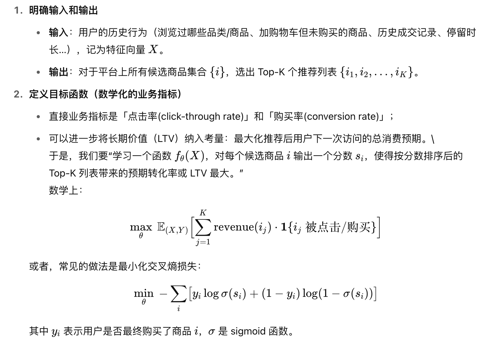

目前各种 AI 辅助编程工具大行其道，Cursor，Windsurf，Copilot，Trae，Claude Code等 IDE/Plugin 各显神威。作为软件工程师，当然不会错过这类实用工具来提高学习和工作效率。不过，我们也会听到一些不同的声音，比如对 AI 辅助编程效果的质疑，对工程师能力要求的改变，对程序员工作前景的担忧，甚至是对 AI 技术本身的争论。本文中我尝试谈谈自己的理解。

## 编程体验派

设想这样一个问题，当 AI 工具可以帮助你完成大部分基础代码，比如语言特性、经典算法、数据结构、设计模式，我们仍然笃定地去学习和掌握其中的精妙之处，那么**除了智识上的优越感和审美上的享受外，是否有其他意义值得追求**？

如果不考虑业务和领域的知识，我也想不到其他的了。但一定需要有吗？对于软件工程师来说，我认为亲自编程动手本身就是一种独特体验，是为**编程体验派**。在最近的一次访谈中，Ruby on Rails的作者 David Heinemeier Hansson (以下简称 **DHH**)就有类似的观点【引用1，视频地址】，他把动手编程比喻为弹吉他，代码一行行敲出，就像旋律从指间流出一样。想收获这种体验，只看琴谱和生成代码是无法获得的。

在敲代码的过程中，你会进入心流状态，审视业务流程，规划代码结构，思考代码的逻辑和质量；甚至手指上下左右移动都充满了节奏感，配合键帽的回弹和响声，何尝不是一种旋律！在你熟悉的IDE中，通过快捷键上下游走，快速编辑，落笔生花，在光标的千万次闪烁中，完成了业务目标。反观生成式的代码，让你更多地依赖单调的Tab键，明明做了很多事情，总感觉好像什么也没做，偶尔会有空虚感袭来......

体验这个东西真是见仁见智，如果你并不在乎体验，而只在乎效率和结果，这正是 AI工具所擅长的，你肯定愿意尝试 **Vibe Coding**【引用 2，来源】。

## Vibe Coding

Vibe Coding 的思路是，先用自然语言描述需求，然后 AI 工具根据需求生成代码，最后工程师评审（Review）并修正（Revise）代码，如此进行迭代。所谓 Vibe（氛围），就是跟着感觉走，不做深入设计，依赖 AI的反馈，不断迭代。

这里的一个关键点是**评审和修正代码**。这要求工程师掌握熟练的编程技能，并且对常用的软件设计和架构思想有一定的理解，否则如何指导 AI 去修改代码设计？如何评价 AI 生成代码的质量？DHH 以作家和编辑为例，好的编辑必然有大量的阅读和良好的写作能力，否则凭什么给作家提建议呢？显然 Vibe Coding 不适合编程技能还在学习阶段的新手，除非你对项目质量要求不高，因为编程学习是需要大量动手和试错的，生产项目通常没有这样的机会。

每种技术都有适合的人群和不适合的人群，这往往是争议的来源。一些技术火热一阵后仿佛销声匿迹了，其实是那些不适合的人群放弃追逐了，而真正契合的人群还在乐此不疲的使用，已然成为工作习惯。

## 反馈循环

为了更好的让 AI 工具为我所用，如何保证其生成代码的可靠性？快速验证生成的代码可以减少在无效代码上浪费的时间，[反馈循环](https://martinfowler.com/articles/exploring-gen-ai/08-how-to-tackle-unreliability.html)（Feedback Loop）【引用3，网址】的概念可以提供一种衡量方式：即需要多久可以验证生成代码的有效性。反馈循环的长短不仅反应了 AI 工具（如 IDE）的易用性，也反应了当前编程场景是否适合使用 AI 完成。例如，Web 前端页面组件只需要在浏览器中打开，即可验证是否生效，反馈循环较短；而云服务的部署代码，可能需要较长的 CI/CD 流程去验证有效性，反馈循环较长。

不使用 AI 工具开发当然也需要反馈循环，测试代码就是其中关键一步，因为测试可以提供快速反馈。AI 生成的代码当然也要通过测试，不同的是利用**AI 生成测试代码**的情况，有时为了通过测试，AI 会尝试修改已有代码设计，甚至写出反模式的代码。因此，不能因为测试通过就万事大吉了，**测试代码的有效性也需要再评审**。从这一角度说，使用 AI 实现测试无疑增加了反馈循环的长度，在应用时要注意权衡。

对于AI 生成的代码要**默认持怀疑态度**，即使大的方向和框架没有错误，为你节省了大把时间，仍然可能因为一个细节错误或幻觉（模型的幻觉已有所改善，但依然存在），导致微妙的 bug，增加更多的调试时间，结果得不偿失。

接下来的问题是：如果保证了 AI 生成代码的有效性，那么我们还能做什么？这其实涉及编程的**抽象层次**。

## 抽象层次

如果不去掌握并灵活运用算法和数据结构的基础知识，而是通过 AI 工具生成需要的代码，那么这里有个抽象的过程：AI 首先要理解实际的问题，然后抽象成能够解决问题的算法或者模型，最后给出代码实现。首先的疑问是 AI 这个能力是哪里来的？

要知道，每个人遇到的业务问题可能是唯一存在的，AI 模型的训练不可能穷尽所有业务代码，因此必须由它自己完成抽象和映射。我觉得有一个可能性，就是很多经典算法就是来自实际问题，而你用自然语言给 AI 的问题描述的方式与一些经典问题异曲同工，AI 就足以映射到已有问题上，进而给出经典算法。换句话说，AI 工具 **get 到了你的问题描述中的“经典”之处**。这也是前AI时代为什么经典理论更为重要的原因。

在进行 Vibe Coding 时，我们思考的抽象层次已经发生变化，Thoughworks有[一篇文章](https://martinfowler.com/articles/exploring-gen-ai/07-how-is-this-different.html#:~:text=One%20of%20the,become%20more%20efficient)定义了几种层次（如下图【引用4，网址】）：从下往上依次是字节码、编程语言、框架、领域模型和低代码等。AI工具在多数情况下，让我们不需要考虑编程语言和框架这类层次的细节，直接完成业务和领域相关的实现，因此抽象层次较高。

但仔细考量，AI 工具的抽象层次并不是单一的，而是**可以贯穿多个层次**。当你用自然语言描述产品需求后，理想情况下，AI 应该完成需求分析、业务建模、系统设计、技术选型、编码实现等各个层次的任务。当然这有赖于 AI 工具本身的能力，以及工程师本身的 Review 和 Revise 的水平。据我所知没有工具可以快速完成上述所有任务并收获令人满意的结果。因此，对于资深工程师来说，这里依然有竞争力。

值得注意的是，AI 工具的能力提升日新月异，对这些技术进步保持开放头脑，否则你**无法重新定义自己的竞争力**。

## 竞争力

竞争力具体体现在哪些方面呢？

对于新手来说，我的建议还是把AI工具当作学习的工具，即使它可以完成部分工作任务，不要把这个当作你的成就，而仅仅是为你节省了时间去学习更多的编程技能。

对于高级工程师和架构师来说，经常需要考虑系统设计的问题，这里面要考虑多种**非功能目标的权衡**（tradeoff），如性能、可用性、成本等。每一个技术决策可能有一些与历史相关的、微妙的上下文，这些知识和背景是 AI 工具无法获取的，但是又是尤为关键的。因此，无论是作为架构师还是工程师，对于项目中的每一个技术决策（当然也包含背后产品的逻辑）的来龙去脉要做到心中有数，当产品变得复杂之后，新的设计决策就会严重依赖之前的每一步改变，这是你的竞争力的提现。

在 AI 时代，把具体需求落实到技术问题的抽象能力依然关键，甚至更为关键。与解决问题的技术能力不同，这是一种问题定义能力，而类似领域建模等**问题定义的技术**永不过时。从抽象层次的角度来说，掌握这样能力的人才应该在靠顶层的位置了。如前所述，在 Vibe Coding 场景下，更为关键的不是全栈的技术，而是**贯穿整个研发周期的、全栈的现代软件工程能力体系**。

前亚马逊应用科学家 Tyler 把企业的 AI 团队按职责分为四种【引用 5，极客时间】：策略团队、模型团队、数据团队、架构团队。其中策略团队是先把产品需求的问题去拆解成一个个数学优化问题。这要求人才同时具有较强的算法抽象能力和业务理解能力。

举一个具体的例子，在一个典型的电商平台中，产品团队可能提出这样的需求：

> “我们希望在用户浏览产品时，实时给他推荐 3–5 款最有可能购买的商品，以提升转化率和客单价。”

这个需求即可拆解为以下一种数学问题：

其实这个过程本身也可以使用生成式 AI 工具辅助完成，毕竟产品需求的描述是自然语言的形式，而从此出发，大语言模型善于完成抽象的过程，然后算法同学再基于生成的结果优化和改进即可。与编码一样，这里也需要有一个完善的Review和Revise的过程。比如上面的数学问题，如果不是做过类似建模的工程师，可能看不出其中是否精准定义了需求的问题，以及是否可以优化。

想要获得持续竞争力，对 AI 工具的发展要保持关注，这篇文章中提到的事实和观点，放在一年后看可能已经不再适用。不断刷新自己的固有认知，更新技术栈，不要轻易放弃还在持续提供价值的技术，转而追求新技术。这涉及如何看待技术和工具。

## 技术的选择

如何看待 AI 工具，定义你与工具的关系，决定了**你有多少主动权**。AI 可以始终作为工具，俯视利用，降本增效，是一种方式；将其视为黑盒魔法，仰视摩拜，是另一种方式；事不关己，冷眼旁观，也是一种方式；

对新技术的选择要保持审慎态度。DHH 有一句话值得深思：It is possible for the society to lose a competence it still needs because it's chasing the future. 技术人都在追求新技能，企业在追求掌握新技能的人，当下流行的、扎实的技能反而无人问津，且这不是 AI 时代的独特性。

不是说不应该与时俱进，而是在追逐新技术时，要对技术的未来作深入剖析：你将收获什么，舍弃什么；本质是什么，有没有跳出本质，有没有颠覆性等等。**技术发展的速度会决定技术选择的机会成本**，因此如果理解不透技术的本质和趋势，就很难选择的收益最大化。

当我们选择 AI 工具去完成编程开发任务，我们是受首要目标驱使：提升研发效率。更进一步说，其实**采用先进技术的本质是释放时间**。

比如美团本质上是一个时间交易公司，你买了商家和外卖员的时间，收获更多的个人可支配时间。但是你如何利用自己的时间，它带了多少价值？买来的时间是否被有效利用？值得反思。

你花钱订阅了各类 AI 编程工具，获得了效率的提升，其实也是花钱买了额外时间，并投入到其他任务中。这个额外时间本来是出售给你当下的雇主的，你又花钱买了一部分回来而已。

纵观历史，每当有技术进步时，总有反对的声音，抨击新的技术和思想对传统的颠覆和所谓的危害。正如《技术垄断》中的一段话【引用 6，技术垄断】：英格兰诗人威廉·布莱克笔下的磨坊是“黑咕隆咚、撒旦出没的磨坊”，夺走了人的灵魂。马修·阿诺德警告我们说，“对机器的信仰”是对人类最大的威胁。卡莱尔、罗斯金、威廉·莫里斯强烈抨击工业进步带来的精神堕落。在法国，巴尔扎克、福楼拜和左拉的小说，详细描绘了“经济人”精神的空虚和渴望冲动的贫乏。

这些说法或许有些道理，适合当时的情境和观念，但不免危言耸听。AI 技术也远没有达到尼尔·波兹曼所谓”**技术垄断**“文化的阶段。技术进步的福利仍然在放大，每个人都有选择的机会，都有重新思考未来的机会。面对 AI 技术的革新，我的建议很简单，**保持好奇，接近它、理解它、怀疑它**。
