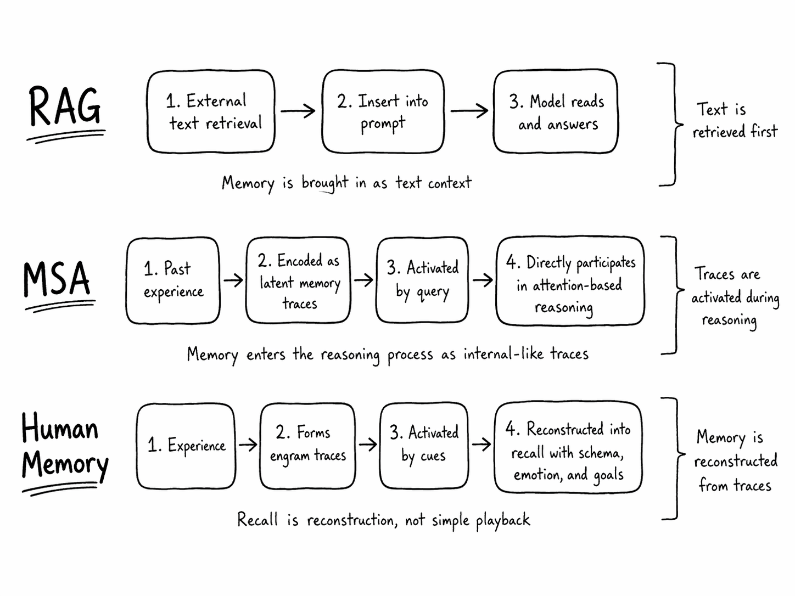
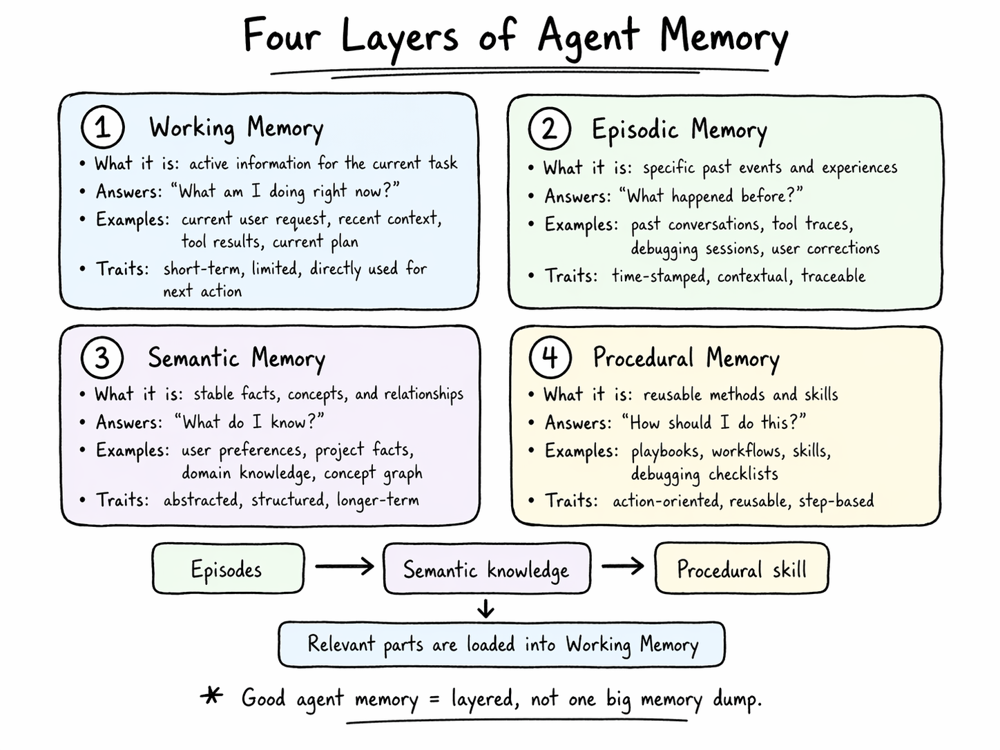
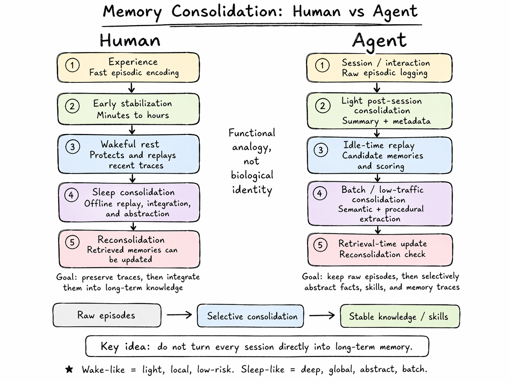
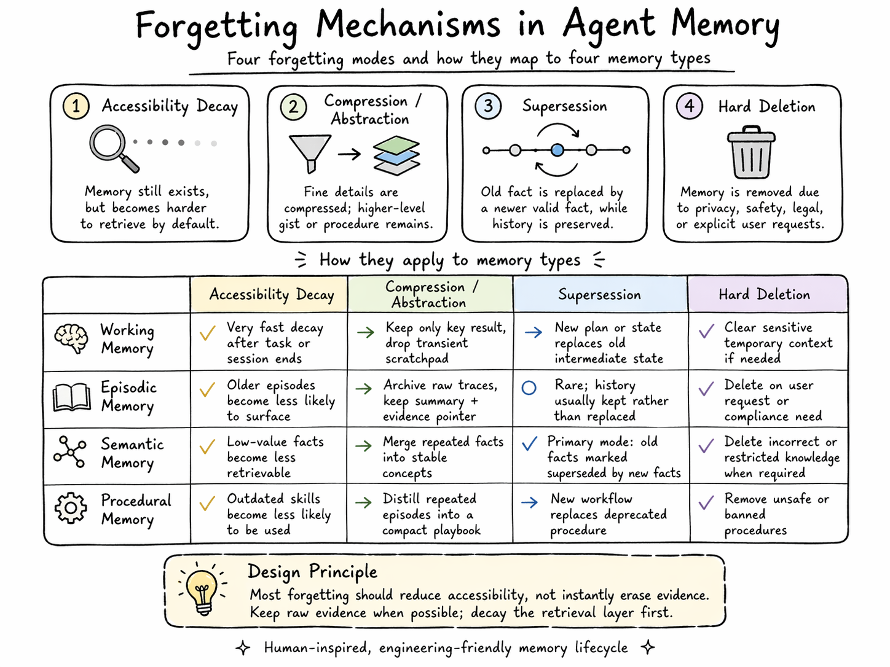
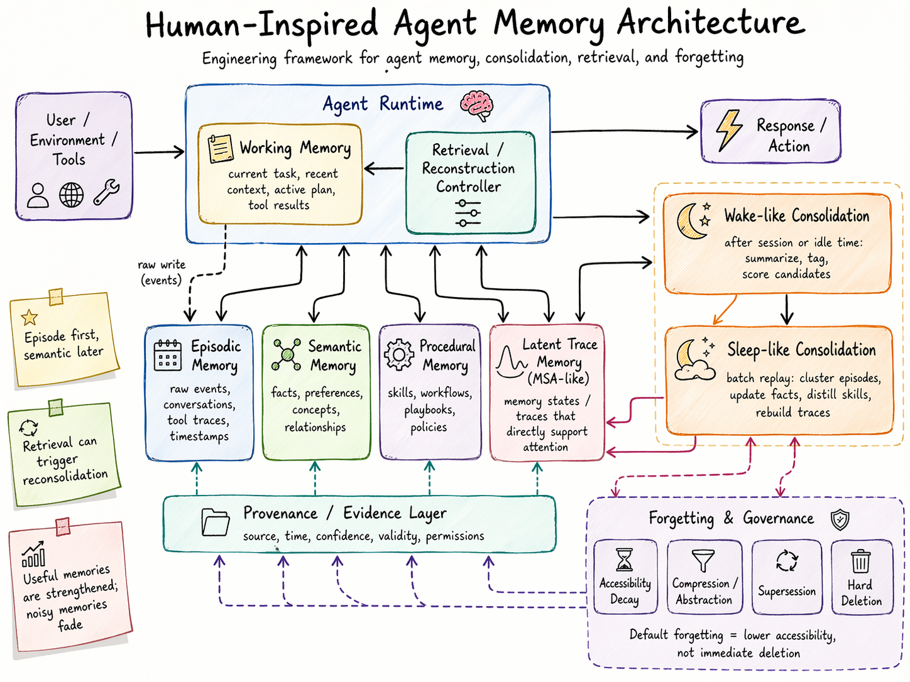

大模型的记忆可以区分为三个层面：
1. 参数记忆：记忆可以写进权重参数，这是模型“真正地“记住了。
2. 上下文/KV 记忆：记忆体现在推理过程内部，如长上下文、KV Cache、Latent Memory Bank。
3. 外部记忆：记忆在模型外部，如向量库、知识图谱和数据库等。

MSA 属于第二种机制，如果应用还需设计预处理和存储机制。有信息召回的可能性，因为即使历史上下文全部被用于 query 的匹配，采用 top-k 的稀疏方案，依然可能导致信息丢失，取决于 router 机制的精确度。router 的索引常驻 GPU 显存，相应的 memory state 常驻内存。

现代研究并不把记忆看成录像回放，而更像一次基于历史线索和当前线索的重建。也就是说，同一段记忆不是放在一个固定地址等你读取，而是**需要合适线索把相关神经活动模式重新带出来**。相关综述指出，记忆检索会**重新激活学习时参与编码的神经元群**。

这是不是与 MSA 的思路很像，不是直接检索 (因为并不存在固定的存储地址)，激活相关的神经活动模式（router 机制）来重建记忆？注意力其实就是记忆重构，关键看是否能“注意到“。

这还意味着，“想不起来”不等于“数据被删除”；可能只是检索路径、线索、当前脑状态没有把相关神经活动模式激活起来。

记忆是生成式的，不是静态的。

因此，
> 类人 agent memory 的核心不是“存更多上下文”，而是“让过去经验以合适的表征形态参与当前推理”。

四类记忆的区分：

值得一提的是，这里面从情节记忆到语义和程序记忆的转变，需要一个沉淀和巩固的过程，通常成为 `Consolidation`。这个过程不必每时每刻都发生，而是发生在特定的时间窗口。

类比人类的记忆，神经科学里通常区分 `Synaptic Consolidation` 和 `Systems Consolidation`。前者更快，发生在学习后的数分钟到数小时尺度，让新形成的痕迹更稳定；后者更慢，涉及**海马—新皮层**之间的长期重组。[参考文献](https://www.sciencedirect.com/science/article/abs/pii/S0306452224002306)

另外，以前大家容易把 Consolidation 主要和睡眠绑定，但近年的研究越来越强调**清醒休息**(`Wakeful Rest`) 也重要。2025 年一项系统综述和 meta-analysis 汇总 37 项研究、63 个实验，发现学习后的安静清醒休息能显著促进记忆巩固，而且效果在 7 天后仍可观察到。[参考文献](https://link.springer.com/article/10.3758/s13423-025-02665-x)

这对 agent 很有启发：不一定非要等离线的批处理，系统空闲时就可以做轻量 replay / consolidation。例如在用户暂停、任务空闲以及会话间隔：

- 回放本次 episode
- 与已有 semantic memory 对齐
- 发现重复模式
- 发现冲突
- 给候选记忆打分

不过，睡眠仍然是巩固（`Consolidation`）的核心窗口之一。2024 年 TMR 综述说，睡眠支持新记忆的强化（`Strengthening`）和整合（`Integration`）；睡眠中的记忆激活（`Memory Reactivation`）被认为涉及新信息的重处理（`Reprocessing`）、重新分布（`Redistribution`），并与已有记忆网络整合。[参考文献](https://www.nature.com/articles/s41539-024-00244-8)

对于 agent 来说，其实无所谓“清醒“还是“睡眠“，因为人类的大脑在两种状态下确实有区别，但 agent 系统的则没有。因此，可以借鉴的是**区分不同的巩固任务类型**，不妨从以下几个角度入手：

- 在线 vs 离线
- 轻量 vs 深度
- 局部 vs 全局
- 近期情节 vs 长期历史
- 低风险整理 vs 高风险更新

人类记忆还有一个非常重要的机制：旧记忆被重新激活后，可能进入短暂可塑状态，然后被加强、削弱或更新。这个叫 `Reconsolidation`。相关研究认为，记忆重新激活会让已存记忆重新变得**可塑**（Labile），随后需要重新稳定，这个窗口可以让记忆**被新信息更新**。

这对 agent 设计也很重要。很多 agent memory 只在写入时做 Consolidation，却忽略了 retrieval-triggered update。例如，在某条旧记忆被检索并用于回答后：

- 检查它是否仍然正确
- 是否出现新证据
- 是否需要提高/降低置信度
- 是否需要合并或拆分

对于巩固的目标，2023 年 Nature Neuroscience 的一篇 complementary learning systems 研究提出一个很有意思的观点：系统巩固的目标不只是“把记忆从海马转移到新皮层”，而是服务于**泛化**（`Generalization`）。

如果环境中有很多不可预测噪声，过度巩固反而会让系统过拟合。这篇文章提出，应该优先巩固**有助于泛化的可预测关系**，而不是所有细节。[参考文献](https://www.nature.com/articles/s41593-023-01382-9)

因此，对于 agent 系统：

不该深度巩固：
- 临时任务细节
- 一次性的调试中间假设
- 没有证据支持的推断

应该优先巩固：
- 用户明确偏好
- 多次重复出现的模式
- 被验证过的项目事实
- 可复用的 troubleshooting 方法

体现类似设计思想的设计系统有开源的 [MemPalace](https://github.com/mempalace/mempalace)。

我使用觉得遗忘也是智能的一部分。

一个永远不忘的 agent 会出现几个问题：

- 旧偏好污染新偏好
- 临时事实被当成长期事实
- 过期项目状态影响决策
- 低价值细节挤占检索空间
- 过去失败经验被过度泛化
- 记忆越多，检索越慢、噪声越大

agent 的遗忘不应该首先设计成“删除”，而应该设计成“可访问性下降”。真正删除只用于隐私、安全、用户明确要求、法律合规和确认无价值的垃圾信息。

这点很像人类记忆。人类遗忘很多时候不是痕迹彻底消失，而是变得更难被线索激活；有些记忆在特定线索、情境或强化后又能被唤起。

近年的 agent memory 研究也在往这个方向走，比如 Oblivion 明确把遗忘定义为 accessibility decay，而不是 explicit deletion。[参考文献](https://arxiv.org/abs/2604.00131)

更进一步，遗忘可以分为四种类型：

| 类型                            | 含义               | 是否删除原始数据 |
| ----------------------------- | ---------------- | -------- |
| **Accessibility Decay**       | 记忆还在，但默认不容易被检索出来 | 否        |
| **Compression / Abstraction** | 细节被压缩，只保留高层语义或方法 | 原始数据可归档  |
| **Supersession**              | 旧事实被新事实替代，但历史仍保留 | 否        |
| **Hard Deletion**             | 彻底删除或不可恢复删除      | 是        |

很多系统只在写入时判断要不要记忆，但遗忘更应该发生在检索时。

最近的 Oblivion 很有启发：它把 memory control 拆成 read path 和 write path。read path 决定什么时候查 memory，避免 always-on retrieval；write path 决定哪些记忆应该被强化。它的核心思想是：遗忘是可访问性的衰减，而不是删除。

遗忘机制设计的可以参考这几个原则：

**原则一：默认先降权，不默认删除**

删除是不可逆操作，应该谨慎。大多数遗忘应该是 accessibility decay。

**原则二：不同 memory 类型用不同衰减率**

临时上下文快衰减；用户明确偏好慢衰减；工具验证过的事实慢衰减；未验证推断快衰减。

**原则三：旧事实不要删除，要标记 validity**

这能避免 agent 没有时间感。旧事实可能对历史问题仍然有用。

**原则四：记忆被使用后要重新评估**

调用一次 memory，不只是 read，也应该触发 reconsolidation check。

**原则五：遗忘要有用户控制**

用户可以明确要求：

- 忘掉这个
- 这条记忆错了
- 这个只在本项目有效
- 这不是我的长期偏好

**原则六：保留原始证据，衰减检索索引**

除非合规或用户要求删除，否则不要轻易丢原始 episode。真正需要动态衰减的是检索层、语义层和 latent memory 激活层。

总结：
