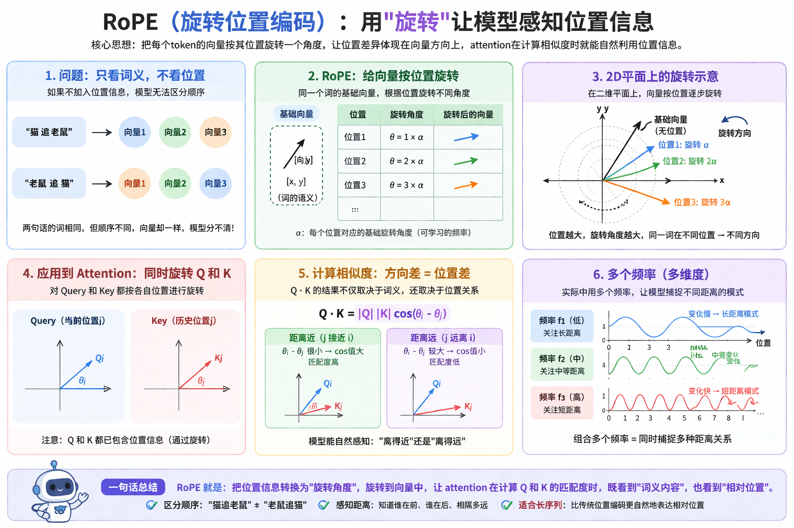

[这篇文章](https://arxiv.org/pdf/2604.00137)提出了一个洞见：

大家过去太关注 tool-use accuracy，也就是模型会不会**选对工具、传对参数**；但现实里另一个同样关键的问题被低估了：intrinsic tool accuracy，也就是**工具本身是否正确、稳定、抗漂移**。

作者提出的 `OPENTOOLS`，本质上是一个把“工具本身”当成持续维护对象的社区化框架，而不只是一个给 agent 挂一堆 API 的工具箱。

这对于 agent 开发者的启示是：

一个 agent 失败，未必是 agent 决策错了，也可能是工具自己就不可靠。如果你不把这两类错误拆开，你对 agent 的判断就会混淆。

具体来说作者把系统拆成两个闭环：

第一条闭环是 `Tool Accuracy / Maintenance Loop`。

它关心的是某个**工具在一组测试上的当前可靠性画像**：是否正确、是否回归、是否因为环境/API 变化而漂移。

论文把它定义成一个**持续更新**的问题，而不是一次性静态测评。工具要有统一 schema、可验证的输入输出、测试集，以及随着社区反馈不断增长的 case 库。

第二条闭环是 `Agentic Workflow`。

这一层才是 agent 使用工具去完成用户任务。

关键点在于，agent 执行时会留下结构化 trace，系统记录工具调用、参数、返回值、异常和错误状态，从而把失败归因到 「tool-use」 问题”还是 「tool-side」 问题。

这相当于给 agent 加了一层可调试、可归因的 `harness`。

为什么关注工具的准确性？因为真实环境里的工具有很多“非模型问题”：

- API 更新
- backend 改动
- 不确定性
- 速率限制
- 静默错误
- 版本漂移（比如某个工具的性能随着时间变差了）
- ...

这些因素都对 agent 完成任务影响较大，如果不加以识别和区分，可能对 agent 的设计或者模型的能力产生误判。

因此，上述的第一条闭环很关键。工具的质量和性能需要动态地维护，需要社区参与进来。

所谓的工具或者 agent 生态，不是提供了多少多样化的工具接入，而是提供了高质量的工具，让 agent 开发专注于业务本身，避免外部的不确定性。

---

[这篇文章](https://arxiv.org/pdf/2604.04921)提出一个优化 KV Cache 的方法：TriAttention

长 reasoning 会把 KV cache 拉得很长，传统的压缩方法往往根据“最近若干 query 的 attention”去判断哪些历史 token 应该保留。

但论文指出，这种思路在 RoPE 下天然不稳：post-RoPE 的 query 会随着位置旋转，所以你看到的“最近若干 query”并**不真正代表更远未来的 query**，观察窗口很小，容易把暂时不活跃、但未来会再次变重要的 token 错删掉。

他们的关键转向是：**不要在 post-RoPE 空间里盯着旋转后的瞬时方向看，而是回到 pre-RoPE 空间**。

在那里，他们观察到大量 head 的 Q/K 向量都不是散乱分布，而是围绕一个固定的非零中心高度集中，而且这种集中在不同位置和不同内容上都相当稳定。他们把这个现象叫做 **Q/K concentration**。

直觉上，这意味着某个 head 不是随便看，而是对“某些距离”的 token 有天然偏好：有的 head 更偏近邻，有的 head 更像 attention sink，会偏远距离或某些特定峰值距离。

通俗地讲，这个方法删除缓存的策略是：

- 每个 attention head 都有自己的“看人习惯”，有的 head 天生更爱看近处，有的 head 会保留某些特定距离的锚点
- TriAttention 先学出这个“看人习惯”
- 推理时就按这个习惯筛历史 token
- 预算不够时，优先删那些“**从这个 head 的习惯看，未来不太可能再被看**”的 token

这篇文章最强的一点，是它把 RoPE 的几何结构和 KV 压缩的系统问题对接上了。这比“某个启发式碰巧有效”更有研究价值，也更有迁移潜力。

理解这篇文章在说什么，起码要知道：
- Attention 机制
- Q，K，V 的概念
- RoPE 的原理

我也事先学习了这些概念，才能看懂一二。

不过说句题外话，在学习和大模型相关的理论时发现，**打比方**的作用很有限：

比方通俗易懂，原理还是一点没理解，打比方打了个寂寞。

我想这可能与深度神经网络的**不可解释性**有关。

---

相关资源：[论文原文 1](https://arxiv.org/pdf/2604.00137) ｜ [论文原文 2](https://arxiv.org/pdf/2604.04921)